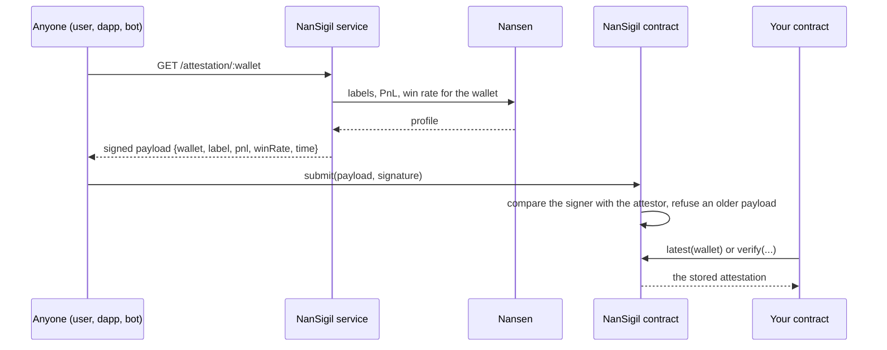
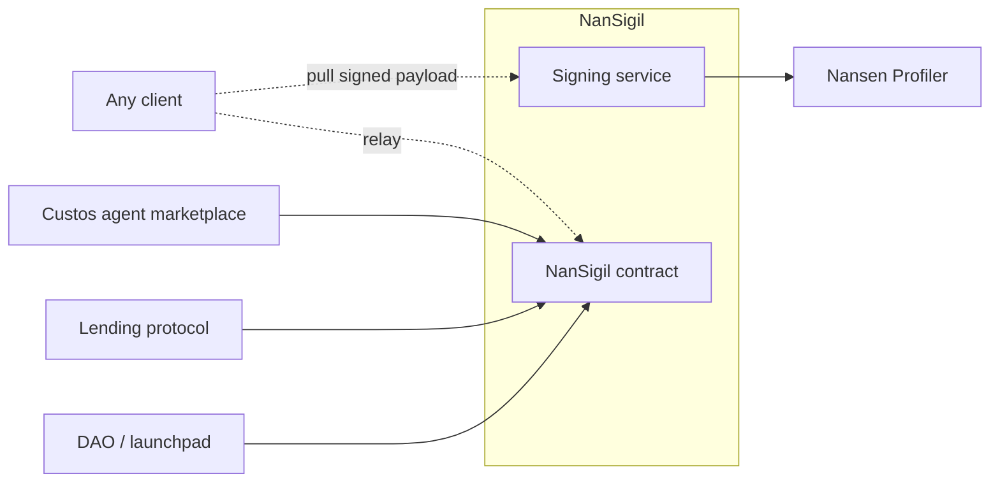

# NanSigil

NanSigil makes what Nansen knows about a wallet available to a smart contract. An attestor signs the data off-chain. Anyone can then send the signed payload on-chain, and any contract can verify it. Only one signing key needs trust, and the address of that key is public.

## The problem

The reputation of a trader is already on-chain. Nansen can tell you which wallets are Smart Traders or Funds, how much they made, and how often they win. A contract cannot read any of this.

Each product that wants the data solves the problem again. One lending protocol gives better terms to a proven wallet. One DAO gates delegation on a track record. One marketplace shows a badge next to a name. Each of them runs a bot, holds an API key, and asks users to trust numbers from a private database.

## What NanSigil does

NanSigil has two parts: a signing service and a contract.

The service answers one question. It reads the profile of a wallet from Nansen, keeps three values from it, adds the current time, and signs the result. The three values are a label, a realized PnL, and a win rate. The service keeps no state and sends no transaction.

The contract is `NanSigil`. It accepts a signed payload from any sender. It compares the signature with the attestor address and keeps only the newest payload for each wallet. Any other contract can then read or verify that payload. An attestation belongs to a wallet, so every consumer reads the same data.

## How it works



The model is pull, not push. The party that wants the data on-chain reads the payload and pays for the transaction. No bot must stay alive, the operator funds no gas, and no update can stop without notice.

## Where it sits



Custos is the first consumer. A creator registers a trading agent, and the attestation of the creator wallet becomes the badge of that agent. The marketplace reads the badge from the contract and not from its own backend. The other consumers in the diagram can use the same payload without a change to NanSigil.

## Endpoints

| Route | Result |
|---|---|
| `GET /attestation/:wallet` | A signed payload for that wallet. The field `pnl` is a decimal string. |
| `GET /health` | The attestor address and the data source, `http` or `fixture`. |

Each call returns a new timestamp, so a new payload always replaces an older one on-chain. The service keeps the Nansen profile of a wallet for `PROFILE_TTL_MS`, which is 10 minutes by default. Repeated calls for the same wallet therefore use no more Nansen credits within that time.

If `NANSEN_API_KEY` is empty, the service reads `fixtures/nansen.json` instead of Nansen. Use this mode for a local demo.

## Commands

```bash
cp .env.example .env
bun install
bun dev          # http://localhost:3001
bun test
```

CAUTION: SET `ATTESTOR_PRIVATE_KEY` TO THE KEY OF THE ADDRESS IN `NanSigil.attestor()`. IF THE TWO ADDRESSES ARE DIFFERENT, THE CONTRACT REFUSES EVERY PAYLOAD WITH `AttestationInvalid`.

## What it is not

NanSigil is verifiable, but it is not trustless. One attestor key signs every payload, and the operator selects which Nansen labels count. Anyone can prove that a payload is genuine. Nobody can prove that the operator was fair. A rotation of the key makes every older payload invalid, and this result is intentional.

## Repositories

This repository contains the signing service. The folder `contract` is a submodule of [`nansigil-contract`](https://github.com/custos-vault-agent/nansigil-contract), which contains the `NanSigil` contract.
