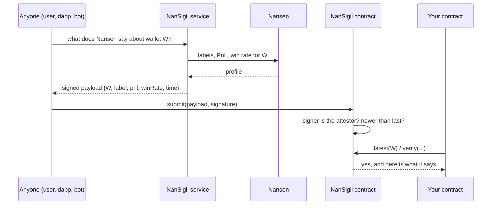
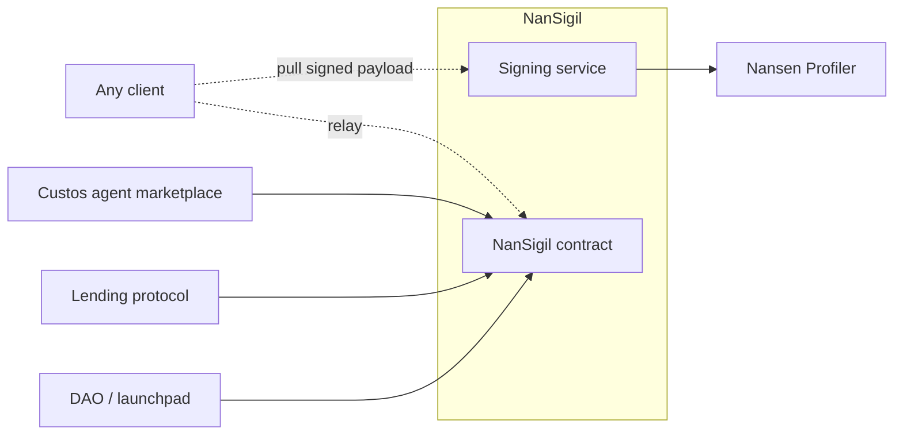

# NanSigil

NanSigil turns what Nansen knows about a wallet into a signed proof that any smart contract can check. The proof is pulled by whoever needs it and carried on-chain by anyone; nothing has to be trusted except one signing key, and that key is public.

## The problem

A trader's reputation already exists on-chain. Nansen can tell you which wallets are Smart Traders or Funds, what they have actually made, and how often they win. None of that is readable by a contract. A lending protocol that wants to offer better terms to a proven wallet, a DAO that wants to gate delegation on a track record, or a marketplace that wants to show a badge next to a creator's name all end up in the same place: running their own bot, holding their own API key, and asking users to trust numbers that came from a database.

## What NanSigil does

NanSigil is a small signing service and a small contract.

The service answers one question: "what does Nansen say about this wallet, and sign it." It looks the wallet up, condenses the answer to a label, a realized PnL and a win rate, stamps the time, and signs the result with the attestor key. It keeps no state and never sends a transaction.

The contract, `NanSigil`, accepts those signed payloads from anyone. It checks the signature against the attestor, keeps only the newest payload per wallet, and lets any other contract read or verify it. An attestation belongs to a wallet, not to any one product, so every consumer sees the same proof.

## How it works

Pull, not push. The party that wants a wallet's reputation on-chain is the one who fetches the proof and pays to submit it. There is no bot that has to stay alive, no gas the operator has to fund, and no update that can silently stop.

## Where it sits

Custos is the first consumer: when a creator registers a trading agent, their wallet's attestation becomes the agent's badge, and the marketplace checks it against the contract rather than trusting its own backend. The other consumers in the picture are what the same proof enables without any change to NanSigil.

## What it is not

NanSigil is verifiable, not trustless. One attestor key signs everything, and the operator decides which Nansen labels count. Anyone can check that a proof is genuine; nobody can check that the operator was fair. Rotating the key invalidates every proof signed with the old one, on purpose.

## Repository

- This repo: the signing service.
- `contract/`: the `NanSigil` contract, included as a submodule from [`nansigil-contract`](https://github.com/custos-vault-agent/nansigil-contract).
